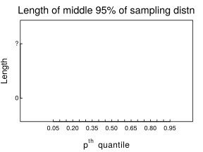
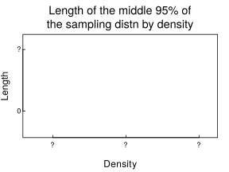

# Which quantiles of a continuous distribution can one estimate with more precision?

The distribution of data is an important characteristic to understand in Data Science. The median is an important quantity in data analysis. It represents the middle value of the data distribution. Estimates of the median, however, have a degree of uncertainty because of several reasons. The first is that the estimates are calculated from a finite sample and second is that the data distribution of the underlying data is generally unknown. One important roles of a data scientist is to quantify and to communicate the degree of uncertainty in his or her data analysis.

In this blog post, we will determine the uncertainty that exists when using certain quantiles of a continous distribution. Because of the reasons stated above, each quantile we calculate will have some uncertainty, some having more so than others. As in previous blog posts, we will be using simulations to explore this topic. 

We will be looking at the following continous probability distributions in this post: 

1. Standard Normal Distributions
2. Exponential Distributions
3. Mixture Distributions

Details about how each distribution works will be discussed before we dig into determining the uncertainties amongst different quartiles of the data generated by these distributions. 

# Setup

In order to explore each distribution, we will create the following graph. The sampling distribution for the quantiles is generated by repeatedly calculating the quantiles from random samples of size N. For the purposes of this blog post, we will let N = 200. We will then calculate the length of the middle 95% of the sampling distribution by calculating the difference between 2.5% and 97.5% percentiles of the sampling distribution. The empirical sampling distribution will be set to at least 5000 draws.

<center>

</center>

Then, we will transform the data we get from these distributions and the above graph to explore the relationship between the density, or relative likelihood and the corresponding *p*<sup>*t**h*</sup> quantile from the previous figure. The x-axis on this figure is a transformation of the x-axis from the previous figure.

<center>

</center>

Using the above figures, we will be able to answer the following questions:

1. Which quantiles have greater precision? 
2. When does the median has the tightest distribution?
3. How do the results change for different values of N (changing sample size from 200 to 400, 800 and 1600)?

# Distribution 1 - Standard Normal Distribution

```{r}
library(ggplot2)
#distribution <- function(n, draws, quartile) {
#  qd <- rep(NA, draws)
#  for (i in 1:draws) {
#    nd <- rnorm(n)
#    qd[i] <- quantile(nd, quartile)
#  }
#  length25 <- quantile(qd, 0.025)
#  length975 <- quantile(qd, 0.975)
#  difference <- abs(length975 - length25)
#  return(as.numeric(difference))
#}

n <- c(200, 400, 800, 1600)
mylist.names <- c("n", "quartile")

multilength <- sapply(mylist.names, function(x) NULL)
for (i in seq_along(n)) {
  multilength[[i]] <- 
}

quartiles <- c(0.05, 0.20, 0.35, 0.5, 0.65, 0.80, 0.95)

quartilelength <- function (n, draws, quartile, type) {
  qlength <- rep(NA, length(quartile))
  for (i in seq_along(quartiles)) {
    qlength[i] <- distribution(n, draws, quartile[i], type)
  }
  return(qlength)
} 

quartilelength(200, 5000, quartiles, "normal")

#nd <- rep(NA, length(quartiles))
#for (i in seq_along(quartiles)) {
#  nd[i] <- distribution(200, 5000, quartiles[i], "normal")
#}
#nd

distribution <- function(n, draws, quartile, type) {
  qd <- rep(NA, draws)
  for (i in 1:draws) {
    if (type == "normal") {
      nd <- rnorm(n)
      qd[i] <- quantile(nd, quartile)
    } else if (type == "exponential") {
      nd <- rexp(n)
      qd[i] <- quantile(nd, quartile)
    } else if (type == "mixture_normal") {
      nd <- rf3(n)
      qd[i] <- quantile(nd, quartile)
    } else if (type == "mixture_beta") {
      nd <- rf4(n)
      qd[i] <- quantile(nd, quartile)
    } else {
      return(NULL)
    }
  }
  length25 <- quantile(qd, 0.025)
  length975 <- quantile(qd, 0.975)
  difference <- abs(length975 - length25)
  return(as.numeric(difference))
}

#distribution(200, 5000, 0.05, "normal")

#qd <- rep(NA, 5)
#  for (i in 1:5) {
#    nd <- rnorm(200)
#    qd[i] <- quantile(nd, 0.05)
#  }
#  length25 <- quantile(qd, 0.025)
#  length975 <- quantile(qd, 0.975)
#  difference <- abs(length975 - length25)


#distribution <- function(n, draws, quartiles) {
#  qd <- rep(NA, draws)
#  for (i in seq_along(n)) {
#    for (j in 1:draws) {
#      for (k in seq_along(quartiles)) {
#        nd <- rnorm(n)
#        qd[j] <- quantile(nd, quartiles[k])
#      }
#    }
#  }
#  return(qd)
#}
#n <- c(200)
#quartiles <- c(0.05, 0.20, 0.35, 0.5, 0.65, 0.80, 0.95)
#distribution(200, 5, quartiles)


#N <- 200
#draws <- 5
#qd <- rep(NA, draws)
#for (i in 1:draws) {
#  nd <- rnorm(N)
#  qd[i] <- quantile(nd, 0.005)
#}


#length25 <- function(x) {
#  quantile(x, 0.025)
#}


```

# Distribution 2 - Exponential Distribution

```{r}

```

# Distribution 3 - Mixture Distribution using Normal Distributions

```{r}
rf3 <- function(N){
  G <- sample(0:2, N, replace = TRUE, prob = c(5,3,2))
  (G==0)*rnorm(N) + (G==1)*rnorm(N,4) + (G==2)*rnorm(N,-4,2)
}

pf3 <- function(x){
  .5*pnorm(x) + .3*pnorm(x,4) + .2*pnorm(x,-4,2)
}

df3 <- function(x){
  .5*dnorm(x) + .3*dnorm(x,4) + .2*dnorm(x,-4,2)
}
```

# Distribution 4 - Mixture Distribution using Beta Distributions

```{r}
rf4 <- function(N){
  G <- sample(0:1, N, replace = TRUE)
  (G==0)*rbeta(N,5,1) + (G==1)*rbeta(N,1,5)
}
```

# Changing Sample Size

```{r}

```

