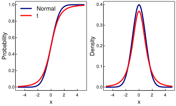

```{r setup, include=FALSE}

knitr::knit_hooks$set(inline = function(x) { knitr:::format_sci(x, 'md')})
knitr::opts_chunk$set(echo = TRUE, cache = TRUE)

# This section loads necessary R libraries and sources scripts that define 
# useful functions format_md.

library(viridis)
library(ggplot2)
library(tidyverse)

```

## Which quantiles of a continuous distribution can one estimate with more precision?

## Background

The median is an important quantity in data analysis. It represents the middle value of the data distribution. Estimates of the median, however, have a degree of uncertainty because (a) the estimates are calculated from a finite sample and (b) the data distribution of the underlying data is generally unknown. One important roles of a data scientist is to quantify and to communicate the degree of uncertainty in his or her data analysis. In this blog post, we will estimate the precision or distribution of order statistics, using analytic methods. 

An order statistic is the variance and distribution of the kth sample of a study. 


Questions
---------

**Q:** Begin with the median from a sample of *N* = 200 from the standard normal distribution. Write an R function that is the density function for the median in this sample. Note that the 100th order statistic is approximately the median, and use the order statistic formula discussed in class. Generate a plot of the function.

```{r}
#lowercase f probability density function
#density function PDF
N = 200
median(rnorm(N, mean = 0, sd = 1)) #create a normal function

dorder <- function(x,k=100,n=N){
  k*
  choose(n,k)*
  (pnorm(x, mean = 0, sd = 1))^(k-1)*
  (1-pnorm(x, mean = 0, sd = 1))^(n-k)*
  dnorm(x)
}

x <- seq(-3, 3, by = 0.01)
plot(x,dorder(x), type = "l")
lines(x, dnorm(x), col= "red") #DENSITY OF x for a standard normal. black line is density of the median statistic for a random normal distribution.
lines(x, dorder(x, k = 50, n = 100), col = "blue")
```

In the above code chunk, I have created a function called dorder, that takes in paramters x (distribution), k (quantile being tested [set to median (100) as default]), and n (sample size, set to 200 as default). We use the mathematical approach to calculating the density of the distribution and then plot it with certain parameters. Since it is a normal distribution, the mean and standard deviation have been set to 0 and 1 respectively. Here,  we have plotted the density of the median of a distribution with N=200 (black), the distribution of the standard normal distribution (red), and the density when the sample size is reduced (blue), demonstrating increasing error with smaller sample sizes. 

**Q:** Write an R function that is the probability function for the median in this sample. Use the order statistic formula discussed in class. Generate a plot of the function.

``` {r}
#uppercase F is CDF
#probability function
#p function probability of that value or to the left of it
porder <- function(x, k = 100, n = 200){
  pbinom(k-1, n, pnorm(x, mean = 0, sd = 1), lower.tail = FALSE)
}

x <- seq(-3, 3, by = 0.01)
plot(x,porder(x), type = "l")
lines(x, pnorm(x), col= "red") #DENSITY OF x for a standard normal. black line is density of the median statistic for a random normal distribution.


```

Above, I create a function porder which gives the probability distribution function for given distribution, sample size and quantile. The black line is the distribution of the median, and the red is the distribution of the standard normal distribution


**Q:** Write an R function that is the quantile function for the median in this sample. (You have several options for how to write this function.) Generate a plot of the function.

``` {r}
#quantile function
g <- function (x,pf,p) pf(x) - p
qorder <- function(p){
  out <- p
  for(i in seq_along(p)){
    out[i] <- uniroot(g, c(-100,100), pf = porder, p = p[i])$root
  }
  out
}

p <- seq(0.05, 0.95, by = 0.01)
plot(p,qorder(p), type = "l")

```

Above, I create a function qorder that uses the concepts of uniroot seen in the previous blog post to get the QDF. 

**Q:** Simulate the sampling distribution for the median as you did in the previous deliverable. Create a plot of the empirical CDF (ECDF). Overlay the plot of the ECDF with a plot of the CDF.

```{r}
meds <- c()
for (i in 1:1000) {
  meds[i] <- median(rnorm(N))
}

meds2 <- qorder(runif(5000)) #generating medians using q function
hist(meds2)
plot(ecdf(meds2))
#plot(ecdf(meds), add = TRUE, col = "blue")
curve(porder(x), add=TRUE, col = "red")

```

As can be seen from the graph above, using the analytic method and the generated CDF both result in very similar plots. This shows that there is a very small amount of error in the method used by porder. 

**Q:** Using the simulated sampling distribution from the previous question, create a histogram (on the density scale). Overlay the histogram with a plot of the density function.

```{r}
hist(meds, freq = FALSE)
curve(dorder(x), add = TRUE, col = "blue")
```

The same principle is used here, and it can be seen that the density function using the analytic method is very similar to the density function created earlier. 

**Q:** One very common way to compare a random sample to a theoretical candidate distribution is the QQ plot. It is created by ploting quantiles of the theoretical distribution on the x-axis and empirical quantiles from the sample on the y-axis.

```{r}
x <- quantile(meds)
y <- quantile(meds2)

plot(x,y, asp = 1)
abline(0,1)
```


If sample and theoretical quantiles come from the same distribution, then the plotted points will fall along the line *y* = *x*, approximately. Here are two examples when the sample and theoretical quantiles came from the same distribution.

``` {r}
random_sample <- rexp(200 )
q_candidate <- qexp

x <- q_candidate((1:200)/200)
y <- quantile(random_sample, probs = (1:200)/200)


plot(x,y, asp = 1)
abline(0,1)

```

``` {r}
random_sample <- meds
q_candidate <- qorder
pp <- ppoints(N)
x <- q_candidate(pp)
y <- quantile(random_sample, probs = pp)

plot(x[1:(N-1)], y[1:(N-1)], asp = 1, xlab = "Theoretical quantile", ylab = "Sample quantile")
abline(0,1)

```


Here is an example when the sample distribution does not match with the theoretical distribution. The sample distribution is *t*<sub>3</sub> where as the theoretical distribution is *N*(0, 1). Notice the deviation from *y* = *x*.

``` {r}
random_sample <- rt(200, df = 3)
q_candidate <- qnorm

x <- q_candidate((1:200)/200)
y <- quantile(random_sample, probs = (1:200)/200)


plot(x,y, asp = 1, xlab = "Theoretical quantile", ylab = "Sample quantile")
abline(0,1)

```


The deviation occurs despite the fact that the two distributions are similar.

<center>

</center>

For the assigment, generate a QQ plot for the simulated data of the median relative to the known sampling distribution of the median.

Does the simulated data agree with the theoretical sampling distribution?

```{r}
random_sample <- rt(200, df = 3)
q_candidate <- qnorm

x <- q_candidate((1:200)/200)
y <- quantile(random_sample, probs = (1:200)/200)

plot(x,y, asp = 1)
abline(0,1)
```


**Q:** Modify the `dorder`, `porder`, and `qorder` functions so that the functions take a new parameter `k` (for the *k*<sup>*t**h*</sup> order statistic) so that the functions will work for any order statistic and not just the median.
```{r}
#These functions have already been described using the parameters above. 
```

**Q:** Generate the QQ plot for simulated data from the sampling distribution of the sample max and the theoretical largest order statistic distribution.
```{r}

```

**Q:** Modify the `dorder`, `porder`, and `qorder` functions so that the functions take new parameters `dist` and `...` so that the functions will work for any continuous distribution that has `d` and `p` functions defined in R.
```{r}

```

**Q:** Use the newly modified functions to plot the probability and density functions for the sample min (*N* = 200).
```{r}

```

