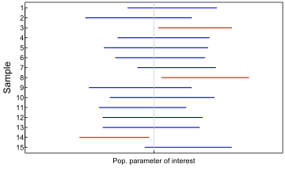

```{r}
library(tidyverse)
```

# Introduction

Coverage probability is an important operating characteristic of methods
for constructing interval estimates, particularly confidence intervals.

**Definition:** For the purposes of this blog post, we define the 95%
confidence interval of the mean to be the middle 95% of sampling
distribution of the mean. Similarly, the 95% confidence interval of the
median, standard deviation, etc. is the middle 95% of the respective
sampling distribution.

**Definition:** For the purposes of this blog post, we define the
coverage probability as the long run proportion of intervals that
capture the population parameter of interest. Conceptualy, one can
calculate the coverage probability with the following steps

1.  generate a sample of size *N* from a known distribution
2.  construct a confidence interval
3.  determine if the confidence captures the population parameter
4.  Repeat steps (a) - (c) many times. Estimate the coverage probability
    as the proportion of samples in which the confidence interval
    captured the population parameter.

The figure below shows the 95% confidence interval calculated for a
handful of samples. Intervals in blue capture the population parameter
of interest; intervals in red do not.



Idealy, a 95% confidence interval will capture the population parameter
of interest in 95% of samples.

# Setup

In this blog post, we will perform a simulation to calculate the
coverage probability of the 95% confidence interval of the median when
computed from *F̂*<sub>*X*</sub><sup>*m**l**e*</sup>.

We will take the following approach in trying to determine the coverage probability of the 95% confidence interval of the median. 

**Step 1:** Generate a single sample from a standard normal distribution
of size *N* = 200. In this setup, we will use MLE to estimate the distribution.

**Step 2:** Approximate the sampling distribution of the median, conditional on the estimate of the distribution generated in the previous step.

**Step 3:** Calculate a 95% confidence interval from the
approximated sampling distribution.

**Step 4:** Calculate the coverage probability.

**Step 5:** Perform the simulation and report the results.


## Generating a single sample

```{r parameters}

parameters <- list(n = 201, dist = "rnorm", mean = 0, sd = 1)

```

```{r generate_data}
generate_data <- function(parameter) {
  if (parameter$dist == "rnorm") {
     parameter$data <- rnorm(parameter$n, parameter$mean, parameter$sd) 
  }
  return(parameter)
}

parameters <- generate_data(parameters)
```

## Estimating the MLE

```{r est.mle}
est.mle <- function(parameter) {
  data <- parameter$data
  parameter$mean <- mean(data)
  parameter$sd <- sqrt(((length(data)-1)/length(data))*var(data))
  return(parameter)
}

parameters <- est.mle(parameters)
```

## Constructing the Confidence Intervals

```{r boot_meds_ci}
boot.meds.ci <- function(parameter) {
  R <- 5000 
  sample.meds <- NA
  for (i in 1:R) {
      sample.data <- parameters %>% generate_data()
      sample.meds[i] <- sample.data$data %>% median
  }
  parameter$CI <- quantile(sample.meds, c(0.025, 0.975))
  return(parameter)
}

parameters <- boot.meds.ci(parameters)
```


```{r}
capture_median <- function(parameter){
  # Hard coded 0 as parameter of interest
  1*(parameter$CI[1] < 0 & 0 < parameter$CI[2])
}

capture_median(parameters)

parameters %>% generate_data %>% est.mle %>% boot.meds.ci %>% capture_median
```


```{r working_solution}

generate_data <- function(parameters) {
  rnorm(parameters[1], parameters[2], parameters[3])
}

capture_median <- function(ci) {
  1*(ci[1] < 0 & 0 < ci[2])
}

est.mle <- function(data) {
  mle.mean <- mean(data)
  mle.sd <- sqrt(((length(data)-1)/length(data))*var(data))
  return(c(length(data), mle.mean, mle.sd))
}

boot.meds.ci <- function(parameters) {
  R <- 5000 
  sample.meds <- NA
  for (i in 1:R) {
      sample.meds[i] <- parameters %>% generate_data() %>% median()
  }
  quantile(sample.meds, c(0.025, 0.975))
}

N <- 201
pop.mean <- 0
pop.sd <- 1
true.parameters <- c(N, mean = pop.mean, sd = pop.sd)
true.parameters %>% generate_data %>% est.mle %>% boot.meds.ci %>% capture_median
```


```{r parallel_run}
parameters <- list(n = 201, dist = "rnorm", mean = 0, sd = 1)
require(foreach)
require(dplyr)
# Create parallel backend
require(doParallel)
cores_2_use <- detectCores() -1
# Create parallel backend
cl <- makeCluster(cores_2_use)
clusterSetRNGStream(cl, 2344)
registerDoParallel(cl)

captures <- foreach(
    i = 1:1000
  , .combine = c
  , .packages = c('dplyr') # Need to indicate which packages
) %dopar% {
  parameters %>% generate_data %>% est.mle %>% boot.meds.ci %>% capture_median
}
mean(captures)
stopCluster(cl)
```

----------------------------

```{r class}
#N %>% generate_data %>% est.mle %>% boot.capture

#in boot capture(generate fhat data %>% get_ci %>% capture_median)
#generate_data

N <- 201
pop.mean <- 0
pop.sample <- rnorm(N,pop.mean,1)
#mle_calculation
mle.sd <- sqrt((N-1)/N)*var(pop.sample) #outside loops
mle.mean <- mean(pop.sample) #outside loops

capture <- NA
for(j in 1:10000) {
    out <- rep(NA, 10000)
  for (i in 1:10000) {
    Fhat.sample <- rnorm(N, mean = mle.mean, sd = mle.sd)
    out[i] <- median(Fhat.sample)
  }
    gen.ci <- quantile(out, c(0.025, 0.975))

capture[j] <- (gen.ci[1] < 0 & gen.ci[2] > 0)
}

mean(capture)
#next
capture


```

```{r boot_ci}
boot_ci <- function(parameter){
  # Hard coded number of draws
  R <- 5000
  # Set median as default summary measure
  sm <- get(parameter$summary)
  sampdist <- rep(NA, R)
  for(i in 1:R){
    b <- sample(parameter$data, length(parameter$data), replace = TRUE)
    sampdist[i] <- sm(b)
  }
  # Hard coded symmetric density interval
  parameter$CI <- quantile(sampdist, c(0.025, 0.975))
  return(parameter)
}

parameters <- boot_ci(parameters)
```

```{r construct_ci}
construct_ci <- function(parameter) {
  if (parameter$dist == "rnorm") {
    parameter$F_hat <- ((parameter$n - 1)/parameter$n)*var(parameter$data)
  }
  return(parameter)
}

parameters <- construct_ci(parameters)


```

```{r}
capture_median <- function(parameter){
  # Hard coded 0 as parameter of interest
  1*(parameter$CI[1] < 0 & 0 < parameter$CI[2])
}
capture_median(parameters)
```

----------------------------


**Step 6:** Describe how you might change the simulation to learn more
about the operating characteristics of your chosen method for
constructing the 95% confidence interval.
